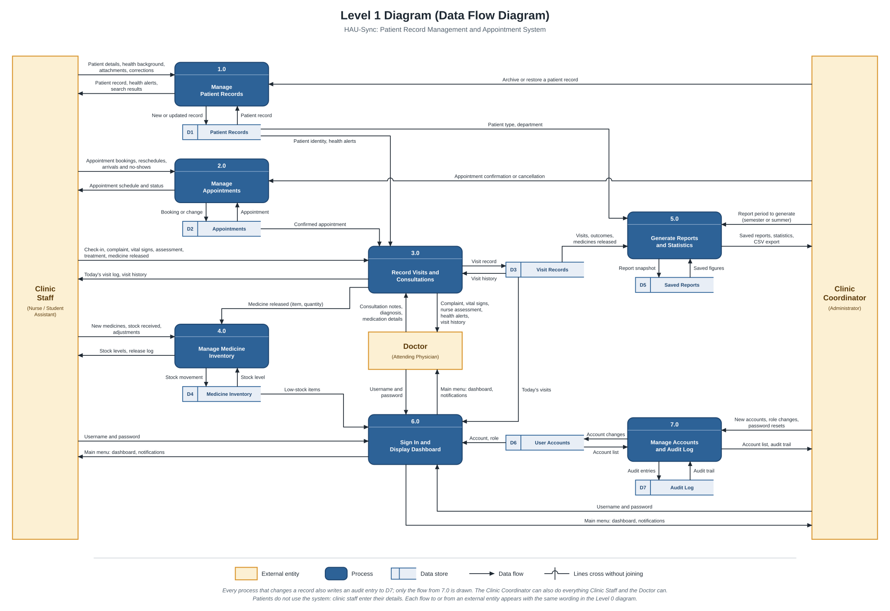
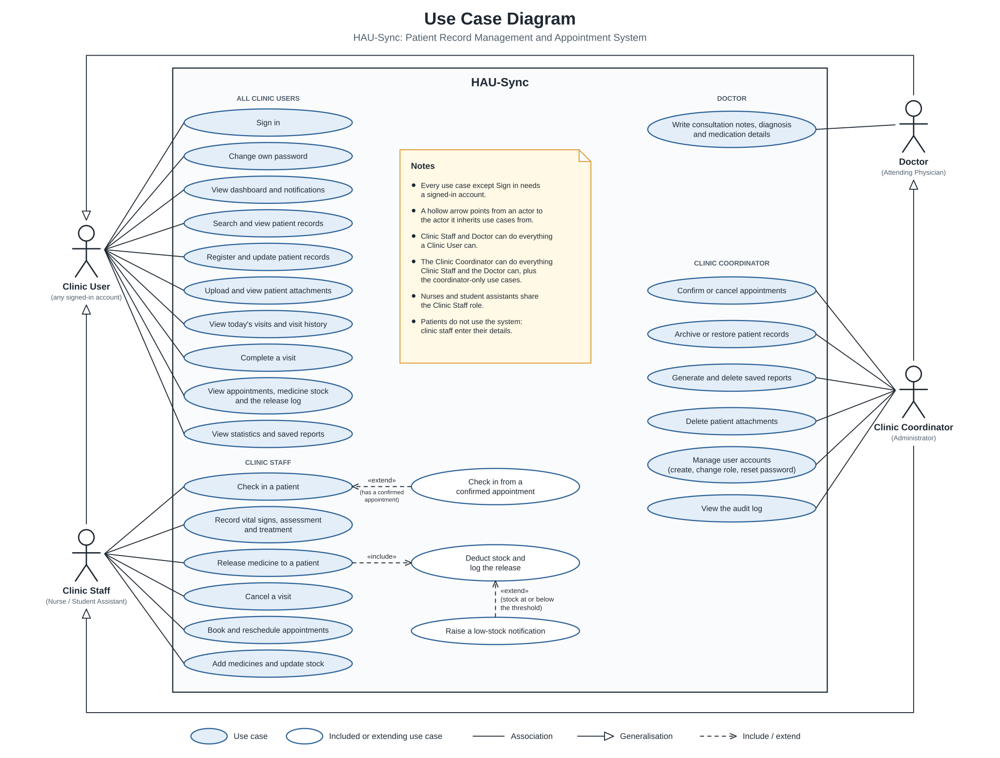

# Diagrams

The analysis and model diagrams of HAU-Sync, redrawn to match the system as it was built.
Each diagram is an SVG, which stays sharp at any size, with a PNG copy for pasting into the
project paper. Click a diagram to open it at full size.

| Diagram | Files |
| --- | --- |
| Level 0 (context diagram) | [`level-0-context-diagram.svg`](level-0-context-diagram.svg), [`.png`](level-0-context-diagram.png) |
| Level 1 (data flow diagram) | [`level-1-data-flow-diagram.svg`](level-1-data-flow-diagram.svg), [`.png`](level-1-data-flow-diagram.png) |
| Use case diagram | [`use-case-diagram.svg`](use-case-diagram.svg), [`.png`](use-case-diagram.png) |

## Level 0 Diagram (Context Diagram)

The whole system as one process, with the people who exchange data with it.

- **External entities.** Clinic Staff (nurses and student assistants, who share one role), the
  Doctor and the Clinic Coordinator. These are the three roles in
  `backend/app/core/permissions.py`.
- **Patients are not an external entity.** The clinic asked for a clinic-only system, so
  patients have no account and never touch it. Clinic staff enter their details.
- **The coordinator's flows.** The Clinic Coordinator can also do everything Clinic Staff and
  the Doctor can. Only the flows that belong to the coordinator alone are drawn, so the same
  flow is not repeated three times.

## Level 1 Diagram (Data Flow Diagram)

Process 0 broken into its seven processes and seven data stores.

| Process | What it covers | Requirements |
| --- | --- | --- |
| 1.0 Manage Patient Records | Register, search, update, archive, attachments | FR-02, FR-03, FR-04, FR-10 |
| 2.0 Manage Appointments | Book, reschedule, confirm or cancel, arrivals | FR-07 |
| 3.0 Record Visits and Consultations | Check-in, vital signs, assessment, consultation, medicine release | FR-05, FR-06, FR-08, FR-09 |
| 4.0 Manage Medicine Inventory | Medicines, stock received, adjustments, release log | FR-11, FR-12 |
| 5.0 Generate Reports and Statistics | Live statistics, saved semester and summer reports, CSV | FR-13, FR-14 |
| 6.0 Sign In and Display Dashboard | Sign-in and the Clinic Main Menu with its notifications | FR-01, FR-12, FR-15 |
| 7.0 Manage Accounts and Audit Log | Accounts, roles, password resets, the audit trail | FR-01 |

- **Balanced with Level 0.** Every flow that touches an external entity carries the same
  wording in both diagrams: 22 flows in each.
- **Stock is only changed by 4.0.** A medicine release goes from 3.0 to 4.0, which deducts the
  stock, the same rule the code follows (`inventory.apply_movement`).
- **Audit entries.** Every process that changes a record writes an audit entry to D7. Only the
  flow from 7.0 is drawn, to keep the diagram readable.
- **Left out on purpose.** The dashboard and the reports also read the appointments in D2, and
  every role can view the statistics. Those read-only flows are not drawn because they would
  only add crossing lines.

## Use Case Diagram

What each kind of account can do, taken from the permission map in
`backend/app/core/permissions.py`.

- **Clinic User** is the general actor: the use cases every signed-in account has.
- **Clinic Staff** and **Doctor** inherit those and add their own.
- **Clinic Coordinator** inherits from both, and adds the coordinator-only use cases.
- **«include»** Releasing medicine always deducts the stock and writes the release log.
- **«extend»** A check-in can start from a confirmed appointment, and a release raises a
  low-stock notification when the stock reaches the threshold.
