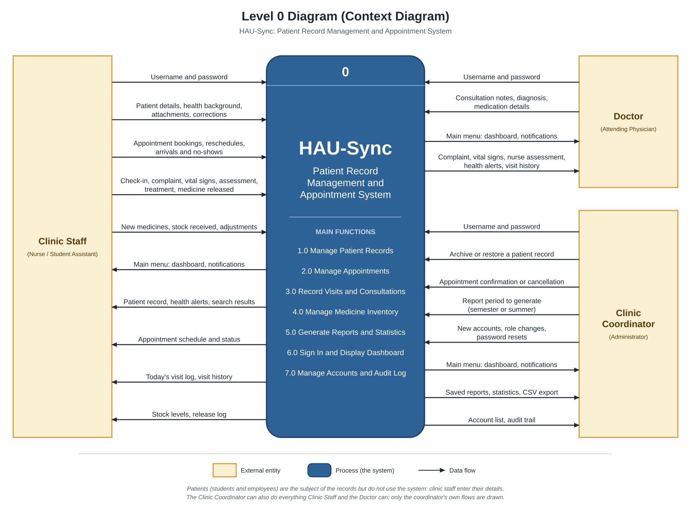

# Diagrams

The analysis and model diagrams of HAU-Sync, redrawn to match the system as it was built.
Each diagram is an SVG, which stays sharp at any size, with a PNG copy for pasting into the
project paper. Click a diagram to open it at full size.

| Diagram | Files |
| --- | --- |
| Level 0 (context diagram) | [`level-0-context-diagram.svg`](level-0-context-diagram.svg), [`.png`](level-0-context-diagram.png) |

## Level 0 Diagram (Context Diagram)

The whole system as one process, with the people who exchange data with it.

- **External entities.** Clinic Staff (nurses and student assistants, who share one role), the
  Doctor and the Clinic Coordinator. These are the three roles in
  `backend/app/core/permissions.py`.
- **Patients are not an external entity.** The clinic asked for a clinic-only system, so
  patients have no account and never touch it. Clinic staff enter their details.
- **The coordinator's flows.** The Clinic Coordinator can also do everything Clinic Staff and
  the Doctor can. Only the flows that belong to the coordinator alone are drawn, so the same
  flow is not repeated three times.
