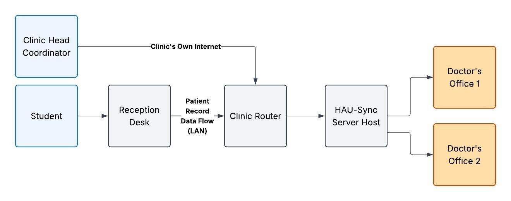

  <h1>HAU-Sync</h1>
  <h3>Patient Record Management and Appointment System for Holy Angel University Clinic</h3>
  
A final project for the course Software Engineering, 
  submitted to Mr. Evicen Flores of Holy Angel University.

<h2 id="site-context">Site Context</h2>

<ul>
  <li><a href="#site-justification">Site Justification</a></li>
  <li><a href="#system-analysis">System Analysis</a></li>
  <li><a href="#design-potential-internal-characteristics">Design Potential: Internal Characteristics</a></li>
  <li><a href="#design-potential-external-characteristics">Design Potential: External Characteristics</a></li>
  <li><a href="#site-context-diagram">Site Context Diagram</a></li>
</ul>

<h3 id="site-justification">Site Justification</h3>

The Holy Angel University Clinic, located on the ground floor of the PGN Building, was chosen as the site for HAU-Sync because its current operations show a clear need for a digital record and appointment system. According to the doctor on call whom the group interviewed, the clinic's school portal support has been cut off, leaving no digital means of recording patient information. All information logs are handwritten, and encoding is done manually. This arrangement leaves the clinic without automation and becomes a hindrance during peak hours, when student traffic is highest. These conditions match the problems described in the Background and confirm that the clinic is a suitable and justified site for the system.

<h3 id="system-analysis">System Analysis</h3>

The clinic currently runs on a fully manual process. A student arrives and tells the receptionist of their concern. The receptionist handwrites the information and hands it to the doctor, who attends to the student. The student leaves after being processed. The clinic is staffed by one doctor on call, one receptionist, and one clinic head coordinator. Its facilities include one infirmary, one waiting area, two doctor's offices, and one dental office. The clinic already has computers and a router, and its internet connection is funded by the clinic head coordinator and is reliable. Because the proposed system runs over a local network, it can use the existing equipment and does not depend on the campus portal or external services.

<h3 id="design-potential-internal-characteristics">Design Potential: Internal Characteristics</h3>

The clinic is physically secure, with lockable rooms and restricted access, which supports the protection of sensitive medical records. The PGN Building has a generator, so a power outage is not a risk and the system can keep running during the clinic's operating hours. The existing computers and router give the system a ready base for the reception desk and doctor's station clients and the local server described in the Design Concept. However, the clinic has no room for expansion, so the system must work within the current space and equipment, with no added rooms or workstations.

<h3 id="design-potential-external-characteristics">Design Potential: External Characteristics</h3>

The clinic sits in a corridor at the middle of the university, which makes it highly accessible to students, teachers, and staff. The campus security office is directly beside the clinic, which gives quick security response and supports emergency situations, and emergency routes are easy to reach. Because the clinic relies on its own internet connection rather than the campus network, the system's operation is not affected by campus network issues.

<h3 id="site-context-diagram">Site Context Diagram</h3>

  
   
  <em>Figure 1. Site context diagram of the HAU Clinic, PGN Building, Ground Floor.</em>

